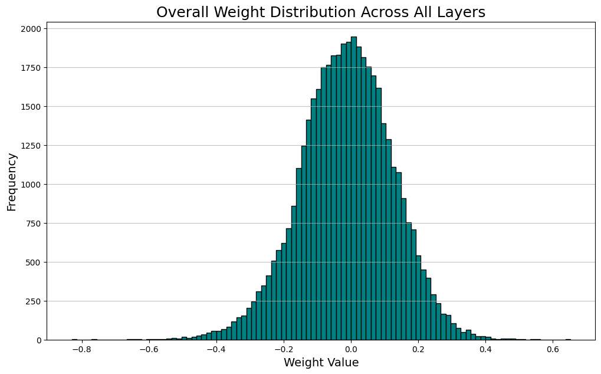
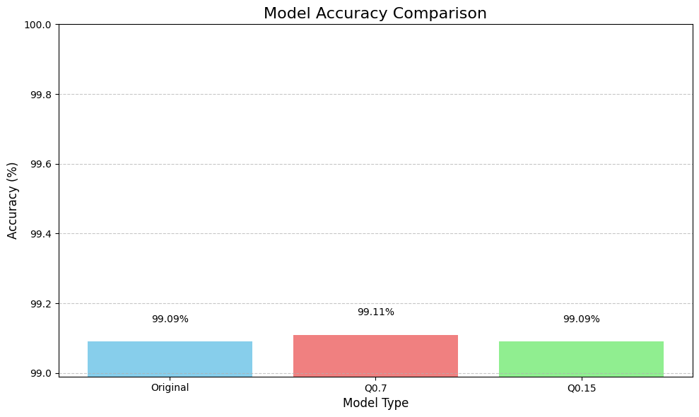
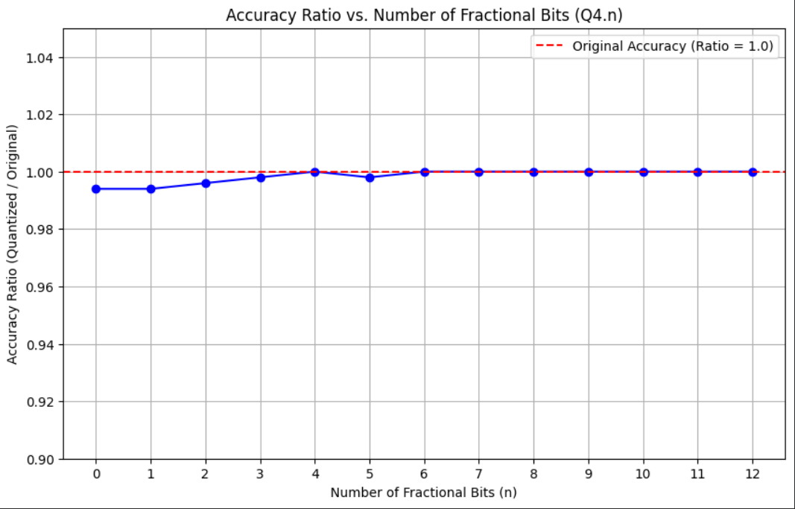
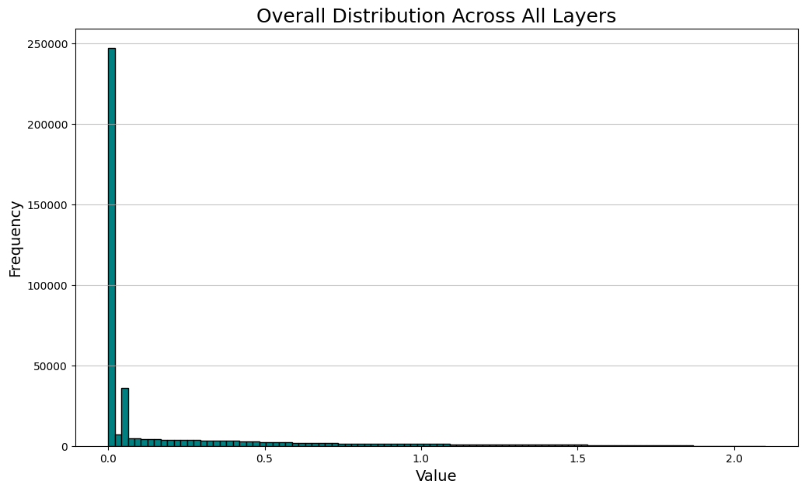
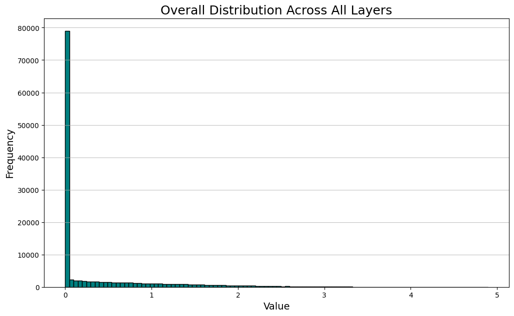
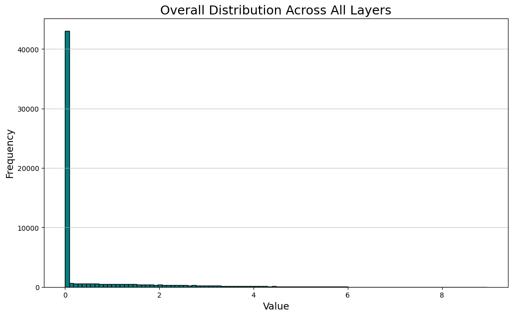
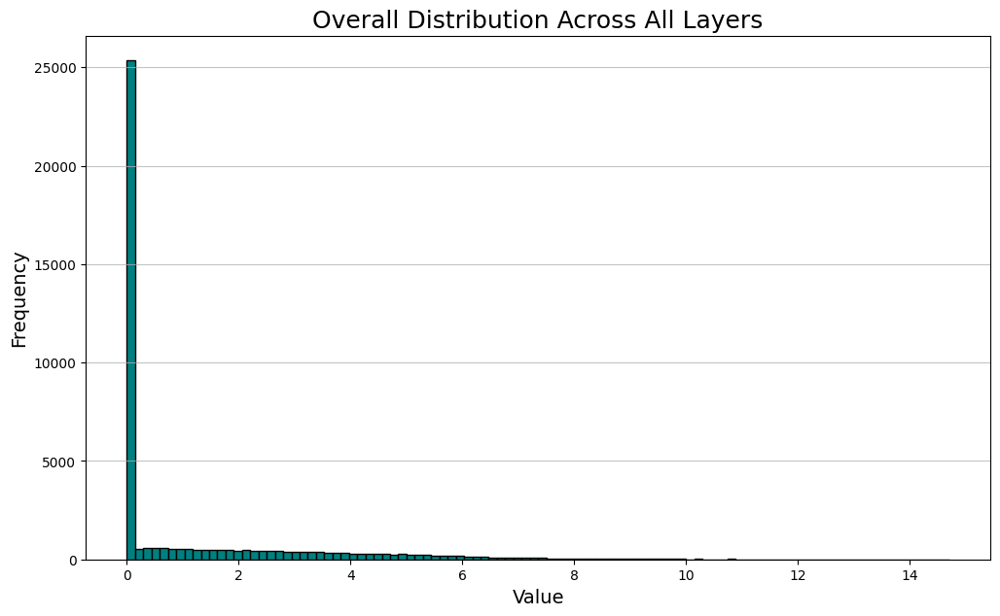

# Fixed Point Representation Results 
- For Weights, we will use `Q0.7 signed`.
- For Features, we will use `Q4.4 Unsigned`.
- Most of image/Features has zero values so to save power we can use sparse multiplication.
- No Features less than zero since we use Relu activation Function so all Feautres has unsigned Fixed point Representation.
____
# Weights Fixed point Analysis
> source `software/Notebooks/LeNet-5 Weight Extraction`

For all extracted weights from the Architecture, we notice the following:
- Total number of combined weights: 44190
- Min weight value: -0.8295
- Max weight value: 0.6526
- Mean weight value: -0.0134
- Standard deviation of weights: 0.1372

## Testing 
- Testing is done by quantizing the model into `Q0.7 Signed` and `Q0.15 Signed` Then save the weights in a new model, and run Evaluation agnist the orignal model for 10000 Test Sample.
- The results show that the loss in accuracy between the 3 models is minimal so it's chosen to use `Q.07 signed` for model weights. 

> Suggested Fixed Point Representation for the Weights is `Q0.7 Signed`
# Features Fixed Point Analysis
> source `software/Notebooks/LeNet-5 Layer Extraction`
- Most of image/Features has zero values so to save power we can use sparse multiplication.
- No Features less than zero since we use Relu activation Function so all Feautres has unsigned Fixed point Representation.
> Suggested Fixed Point Representation for the Features is `Q4.4 unsigned`
## Decimal Side Anaylsis
### Testing
- Divide Model into independent Sub-models which divided by precence of RAM in HW Architecture:
    1. Conv1/Pool1 Layer.
    2. Conv2/Pool2/Flatten Layer.
    3. Dense1 Layer.
    4. Dense2 Layer.
    5. output Layer.
- Quantize the output Features in Fixed Point Representation Q4.n unsigned and loop on n from 0 to 12 before passing it to the next layer.
- the goal is to test final output accuracy aganist the original model for 500 test sample.
### Results 
- The results show that accuracy is not affected as much by quantization.
- We choose `Q4.4 unsiged` since the output will be 8 bit keeping parameters/variables consitancy with respect to size.

## Integer Side Analysis
### Input Layer 
- 8 bit input can be used to represent gray scale image.
> suggested Fixed point Representation for this layer is `Q0.8 unsigned`
### Conv1 Layer 
> ``NOTE`` This layer implementation is hidden in our HW Architecture which means that its output features doesn't output in any RAM.
- all image generate features greater than one in this stage.
- the precentage of features greater than one is `3.41%`
- Max Feature value is approximately `2.1`.
> suggested Fixed point Representation for this layer is `Q3.8 unsigned`

### Pool1 Layer 
- all image generate features greater than one in this stage.
- the precentage of features greater than one is `6.92%`
- Max Feature value is approximately `2.1`.
> suggested Fixed point Representation for this layer is `Q3.8 unsigned`

### Conv2 Layer 
> ``NOTE`` This layer implementation is hidden in our HW Architecture which means that its output features doesn't output in any RAM.
- all image generate features greater than one in this stage.
- the precentage of features greater than one is `6.20%%`
- `80%` of outputs are zeros.
- Max Feature value is approximately `4.9`.
> suggested Fixed point Representation for this layer is `Q3.8 unsigned`

### Pool2 Layer 
- all image generate features greater than one in this stage.
- the precentage of features greater than one is `15.67%`
- Max Feature value is approximately `4.9`.
> suggested Fixed point Representation for this layer is `Q3.8 unsigned`

### Dense1 Layer
- all image generate features greater than one in this stage.
- the precentage of features greater than one is `19.12%`
- `70%` of outputs are Zeros.
- Max Feature value is approximately `9.6`.
> suggested Fixed point Representation for this layer is `Q4.8 unsigned` 

### Dense2 Layer
- all image generate features greater than one in this stage.
- the precentage of features greater than one is `32.05%`
- `59%` of outputs are Zeros.
- Max Feature value is approximately `14.8`.
> suggested Fixed point Representation for this layer is `Q4.8 unsigned` 

### Output Layer
- the output is probablity between Zero and one.
- Most outputs are either near 0 or near 1.
> suggested Fixed point Representation for this layer is `Q0.8 unsigned` 
